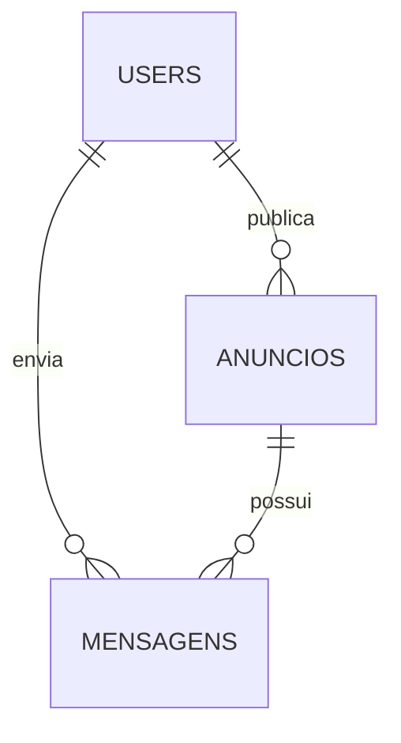

# 🌱 EletroLight — Plataforma de Doação e Troca de Eletrônicos

Plataforma web completa para **doação e troca de eletrônicos usados**, conectando a comunidade de Manaus com pontos de coleta e promovendo a economia circular para reduzir o lixo eletrônico.

> **Backend**: Supabase (PostgreSQL) com localStorage fallback  
> **Autenticação**: Custom (email/CPF) com Row Level Security  
> **Chat**: Mensagens em tempo real com notificações  
> **Admin**: Painel de moderação com aprovação de anúncios, denúncias e punições

---

## 📋 Sumário

1. [Visão Geral](#visão-geral)
2. [Funcionalidades](#funcionalidades)
3. [Arquitetura do Sistema](#arquitetura-do-sistema)
4. [Estrutura de Arquivos](#estrutura-de-arquivos)
5. [Diagramas UML](#diagramas-uml)
6. [Fluxos de Uso](#fluxos-de-uso)
7. [API de Dados](#api-de-dados)
8. [Como Executar](#como-executar)
9. [Tecnologias Utilizadas](#tecnologias-utilizadas)
10. [Validações e Regras de Negócio](#validações-e-regras-de-negócio)
11. [Notas para Desenvolvedores](#notas-para-desenvolvedores)

---

## 🎯 Visão Geral

O EletroLight é uma aplicação web **full-stack** focada em:

- **Economia Circular**: Doação e troca de eletrônicos entre usuários
- **Chat Integrado**: Comunicação direta entre interessados e anunciantes
- **Conscientização**: Canal educativo sobre e-lixo e impactos ambientais
- **Geolocalização**: Mapa interativo com pontos de coleta em Manaus
- **Gamificação**: Sistema de anúncios estilo OLX com categorias

### 🔧 Stack Técnico
| Camada | Tecnologia |
|--------|------------|
| **Frontend** | HTML5, CSS3, JavaScript ES6+ |
| **Backend** | Supabase (PostgreSQL + PostgREST) |
| **Auth** | Sessão custom em `sessionStorage` |
| **Storage** | Supabase Storage para fotos |
| **Fallback** | localStorage (modo offline) |

---

## ✨ Funcionalidades

### 🏠 Página Principal (index.html)

| Seção | Descrição |
|-------|-----------|
| **Hero** | Carrossel de imagens com autoplay e navegação manual |
| **Mapa de Coleta** | Mapa Leaflet com **pinos SVG customizados** (estilo moderno com círculo branco) e lista lateral agrupada por **zonas de Manaus** (Norte, Leste, Oeste, Sul) em acordeões |
| **Canal de Aprendizado** | Abas com conteúdo educativo sobre e-lixo e curiosidades sobre o Brasil |
| **Anúncios (Serviços)** | Grid de anúncios com filtro por múltiplas categorias (máx. 5 na home) e botão Editar para anúncios próprios |
| **Chatbot** | Assistente virtual demonstrativo com respostas fixas |
| **Sobre o Projeto** | Informações institucionais |

### 📢 Sistema de Anúncios

| Funcionalidade | Descrição |
|----------------|-----------|
| **Anunciar Eletrônico** | Formulário completo com upload de fotos ao Supabase Storage |
| **Categorias** | 11 categorias: celulares, notebooks, TVs, tablets, áudio, videogames, eletrodomésticos, cabos, pilhas, periféricos, **outros** |
| **Filtro Dinâmico** | Seleção múltipla de categorias com botões toggle (igual no index e em todos-anuncios) |
| **Lista Completa** | Página `todos-anuncios.html` com busca textual e seleção múltipla de categorias |
| **Meus Anúncios** | Gerenciamento com notificações de mensagens. Exibe anúncios pendentes e rejeitados com badge de status |
| **Editar Anúncio** | Modal de edição para todos os campos |
| **Excluir Anúncio** | Confirmação antes de remover do Supabase |
| **Persistência** | Supabase PostgreSQL com localStorage fallback |

### 💬 Sistema de Chat

| Funcionalidade | Descrição |
|----------------|-----------|
| **Chat em Anúncios** | Página `anuncio-detalhe.html` com visualização detalhada + chat |
| **Para Visitantes** | Visualização do anúncio + prompt para login/cadastro |
| **Para Usuários Logados** | Envio de mensagens ao anunciante |
| **Para Anunciante** | Painel de conversas com todos os interessados |
| **Notificações** | Badge vermelho com contagem de conversas pendentes |
| **Foto de Perfil** | Avatar do anunciante exibido no **header do chat** (foto ou inicial do nome) |
| **RLS** | Apenas usuários cadastrados podem enviar mensagens |
| **Denunciar** | Menu ⋮ no header do chat → modal com **select de motivo** (5 opções) + descrição opcional → salva na tabela `denuncias` |
| **Restrição de chat** | Usuários bloqueados não conseguem enviar mensagens |
| **Balões de mensagem** | Mensagens próprias em verde `#10B981` (mesmo do hover das categorias) |
| **Subtítulo do chat** | Exibe tipo de negociação abaixo do nome: *"Negociação • Troca/Doação"* |

### 🛡️ Painel Administrativo (pages/admin.html)

| Funcionalidade | Descrição |
|----------------|-----------|
| **Acesso restrito** | Apenas usuários com `is_admin = true` no Supabase podem acessar |
| **Anúncios Pendentes** | Lista anúncios com status `pendente` para aprovar ou rejeitar antes da publicação |
| **Denúncias** | Visualiza denúncias de usuários com filtro por status (pendentes/resolvidas) |
| **Tomar Ação** | Modal com 5 opções: sem punição, bloquear publicações, bloquear chat, bloquear ambos, excluir conta |
| **Conteúdo Educativo** | CRUD completo para gerenciar os textos exibidos no canal de aprendizado |
| **Usuários Restritos** | Lista usuários bloqueados com opções de revogar restrições individualmente |

### 🔐 Sistema de Autenticação (login/)

| Funcionalidade | Descrição |
|----------------|-----------|
| **Cadastro** | Nome completo, CPF (com validação algorítmica), data de nascimento (18+), e-mail, senha |
| **Login** | Acesso via e-mail **ou** CPF — sem recuperação de senha |
| **Validações em Tempo Real** | Nome sem caracteres especiais, checklist de requisitos de senha |
| **Força da Senha** | Barra visual colorida (Fraca/Média/Forte) durante digitação |
| **Mostrar/Ocultar Senha** | Botão de olho customizado em todos os campos de senha (bloqueio em 16 caracteres) |
| **Validações** | CPF único, e-mail único, senha 8-16 chars, 1 maiúscula, 1 especial, 18+ anos |
| **Sessão** | `eletrolight_session` em `sessionStorage` |
| **Perfil no Header** | Nome do usuário logado com dropdown (Editar Perfil, Meus Anúncios, Sair) em todas as páginas |
| **Proteção** | Páginas restritas redirecionam para login se não autenticado |

---

## 🏗️ Arquitetura do Sistema

```
EletroLight/
├── index.html                 # Página principal (entry point)
├── README.md                  # Documentação do projeto
│
├── pages/                     # Páginas HTML internas
│   ├── anunciar.html          # Formulário de novo anúncio (protegido)
│   ├── anuncio-detalhe.html   # Visualização detalhada + Chat
│   ├── todos-anuncios.html    # Listagem completa com busca
│   ├── meus-anuncios.html     # Gerenciamento com notificações
│   ├── perfil.html            # Edição de perfil do usuário
│   ├── admin.html             # Painel administrativo (restrito)
│   └── questionario-ux.html   # Questionário de avaliação de usabilidade
│
├── styles/                    # Arquivos CSS
│   ├── style.css              # Estilos globais e componentes
│   ├── anunciar.css           # Estilos específicos do formulário
│   └── perfil.css             # Estilos da página de perfil
│
├── scripts/                   # Arquivos JavaScript
│   ├── script.js              # Lógica da home (carrossel, mapa, anúncios)
│   ├── supabase-client.js     # Inicialização do cliente Supabase
│   ├── supabase-service.js    # Serviço de dados (CRUD + Chat + Admin)
│   ├── anuncios-data.js       # Camada de dados com fallback localStorage
│   ├── anunciar.js            # Lógica do formulário
│   └── perfil.js              # Validações e salvamento de perfil
│
├── diagramas/                 # Diagramas UML
│   ├── diagrama-er.md         # Diagrama Entidade-Relacionamento
│   └── diagrama-classes.md    # Diagrama de Classes
│
├── assets/                    # Recursos estáticos
│   └── images/                # Imagens e assets visuais
│
└── login/                     # Sistema de autenticação
    ├── login.html             # Interface de login/cadastro
    ├── login.css              # Estilos do painel deslizante
    └── login.js               # Validações, máscaras, autenticação
```

### Fluxo de Dados

```
Usuário cadastra → Supabase (tabela users)
     ↓
Usuário loga → sessionStorage (eletrolight_session + is_admin)
     ↓
Cria anúncio → Supabase (status = 'pendente') → aguarda aprovação admin
     ↓
Admin aprova → status = 'aprovado' → anúncio aparece publicamente
     ↓
Envia mensagem → verifica bloqueio_chat → Supabase (tabela mensagens)
     ↓
Denúncia enviada → tabela denuncias → admin resolve com punição
     ↓
Fallback offline → localStorage (modo sem conexão)
```

---

## 📁 Estrutura de Arquivos Detalhada

| Arquivo | Responsabilidade | Banco de Dados |
|---------|-----------------|----------------|
| `supabase-client.js` | Inicializa cliente Supabase com URL e anon key | - |
| `supabase-service.js` | CRUD completo: users, anuncios, mensagens | `users`, `anuncios`, `mensagens` |
| `anuncios-data.js` | Camada de dados com fallback localStorage | Supabase + localStorage |
| `login.js` | Cadastro, login, validação de CPF, sessão | `users` |
| `script.js` | Carrossel, mapa Leaflet, filtros, abas | - |
| `anunciar.js` | Formulário de anúncio, upload de fotos | `anuncios` + Storage |
| `perfil.js` | Edição de perfil, alteração de senha | `users` |
| `questionario-ux.html` | Coleta de feedback de usabilidade | `eletrolight_ux` (localStorage) |

### Tabelas Supabase

| Tabela | Descrição | RLS |
|--------|-----------|-----|
| `users` | Cadastro de usuários (nome, CPF, email, senha, foto, is_admin, bloqueio_publicacao, bloqueio_chat) | Desabilitado |
| `anuncios` | Anúncios com campo `status` (pendente/aprovado/rejeitado) | Público leitura (só aprovados), proprietário escrita |
| `mensagens` | Chat entre usuários | Leitura pública, inserção apenas usuários cadastrados |
| `denuncias` | Denúncias de anúncios e perfis | Inserção pública, leitura restrita ao admin |
| `conteudo_educativo` | Textos do canal educativo (gerenciado pelo admin) | Leitura pública, escrita restrita ao admin |

---

## 🔄 Fluxos de Uso

### 1. Cadastro de Novo Usuário
```
login.html → Painel Cadastro → Valida CPF → Salva no Supabase (tabela users)
→ Toast de sucesso → Redireciona para painel Login
```

### 2. Login com E-mail ou CPF
```
login.html → Detecta tipo (CPF começa com número) → Busca no array
→ Valida senha → Cria sessão → Redireciona para index.html
```

### 3. Criar Anúncio (Fluxo Protegido + Moderação)
```
index.html → Clica "Anunciar" → Verifica sessão
    ├─ [Não logado] → login.html?cadastro=1
    └─ [Logado] → verifica bloqueio_publicacao
        ├─ [Bloqueado] → alerta de restrição
        └─ [Liberado] → anunciar.html
            → Preenche formulário → Comprime imagem → Salva (status='pendente')
            → Aguarda aprovação do admin antes de aparecer publicamente
```

### 9. Moderar Anúncios (Fluxo Admin)
```
admin.html → Aba "Anúncios Pendentes"
→ Admin clica Aprovar → status = 'aprovado' → anúncio visível
→ Admin clica Rejeitar → status = 'rejeitado' → anúncio removido
```

### 10. Resolver Denúncia com Punição
```
Usuário logado → anuncio-detalhe.html → Clica "Denunciar"
→ Modal com tipo + motivo + descrição → Envia para tabela denuncias

admin.html → Aba "Denúncias" → Clica "Tomar Ação"
→ Modal de punição:
    ├─ Sem punição → apenas arquiva
    ├─ Restringir publicações → bloqueio_publicacao = true
    ├─ Restringir chat → bloqueio_chat = true
    ├─ Restringir ambos → ambos = true
    └─ Excluir conta → remove user + anúncios (confirmação dupla)
→ Denúncia marcada como resolvida automaticamente
```

### 11. Gerenciar Restrições
```
admin.html → Aba "Usuários Restritos"
→ Lista usuários com bloqueios ativos
→ Admin pode revogar publicação, chat ou excluir conta
```

### 4. Visualizar Anúncio Detalhado + Chat
```
todos-anuncios.html → Clica "Tenho Interesse" ou "Propor Troca"
→ Redireciona para anuncio-detalhe.html?id=<id>
    ├─ [Visitante] → Vê detalhes + botões "Fazer Login / Criar Conta"
    └─ [Logado] → Vê detalhes + área de chat para enviar mensagens

meus-anuncios.html → Clica "Ver Mensagens"
→ anuncio-detalhe.html mostrando painel de conversas com interessados
```

### 5. Editar Anúncio (Fluxo do Proprietário)
```
index.html ou todos-anuncios.html → Clica "Editar Anúncio" no card próprio
→ Redireciona para meus-anuncios.html?editar=<id>
→ Abre modal pré-preenchido → Edita campos → Salva no Supabase
→ Atualização em tempo real nos cards
```

### 6. Gerenciar Meus Anúncios
```
Header → Dropdown → "Meus Anúncios"
→ Lista filtrada apenas com anúncios do usuário
→ Badge vermelho com número de conversas pendentes
→ Opções: Ver Mensagens, Editar (modal) ou Excluir
```

### 7. Visualizar Todos os Anúncios
```
index.html (máx. 5 anúncios) → "Ver todos" → todos-anuncios.html
→ Busca por texto OU filtro por categoria
→ Cards de terceiros: "Tenho Interesse" / "Propor Troca" → anuncio-detalhe.html
→ Cards próprios: "Editar Anúncio" → meus-anuncios.html
```

### 8. Responder Questionário UX
```
questionario-ux.html → Responde 7 perguntas → Envia
→ Salva em localStorage (eletrolight_ux) → Tela de agradecimento
```

---

## � Diagramas UML

Os diagramas estão disponíveis na pasta `diagramas/` para uso no [Mermaid Live Editor](https://mermaid.live):

### Diagrama Entidade-Relacionamento
**Arquivo**: `diagramas/diagrama-er.md`

Entidades: `users`, `anuncios`, `mensagens`



### Diagrama de Classes
**Arquivo**: `diagramas/diagrama-classes.md`

Namespaces: `Entidades` (User, Anuncio, Mensagem, Session) e `Servicos` (SupabaseService, AnunciosData)

---

## 💾 API de Dados

### Supabase (Principal)

| Tabela | Colunas Principais |
|--------|-------------------|
| `users` | id, nome, cpf, email, senha, whatsapp, foto, is_admin, bloqueio_publicacao, bloqueio_chat, created_at |
| `anuncios` | id, titulo, categoria, tipo, condicao, descricao, foto, nome, email, whatsapp, bairro, **status**, created_at |
| `mensagens` | id, anuncio_id, remetente_email, remetente_nome, destinatario_email, destinatario_nome, texto, created_at |
| `denuncias` | id, tipo, alvo_email, alvo_id, alvo_titulo, motivo, descricao, denunciante_email, status, created_at |
| `conteudo_educativo` | id, titulo, categoria, texto, link_video, ativo, created_at, updated_at |

### localStorage (Fallback/UX)

```javascript
// Sessão atual (sessionStorage na verdade)
sessionStorage.setItem('eletrolight_session', JSON.stringify(
  { nome: "João Silva", email: "joao@email.com", is_admin: false }
));

// Mensagens offline (fallback)
localStorage.setItem('eletrolight_mensagens', JSON.stringify([...]));

// Questionário UX
localStorage.setItem('eletrolight_ux', JSON.stringify([...]));
```

### Funções Exportadas (supabase-service.js)

| Função | Descrição |
|--------|-----------|
| `findUserByEmail(email)` | Busca usuário por email |
| `saveUser(user)` | Cadastra novo usuário |
| `getAnuncios()` | Retorna anúncios aprovados (`status = 'aprovado'`) |
| `adicionarAnuncio(anuncio)` | Cria novo anúncio (status = 'pendente') |
| `getMensagens(anuncioId, emailA, emailB)` | Retorna histórico de chat |
| `enviarMensagem(...)` | Envia mensagem (Supabase + fallback) |
| `getConversasDoAnuncio(anuncioId, ownerEmail)` | Lista conversas para notificação |
| `getAnunciosPendentes()` | Lista anúncios aguardando moderação |
| `aprovarAnuncio(id)` | Define status = 'aprovado' |
| `rejeitarAnuncio(id)` | Define status = 'rejeitado' |
| `getDenuncias()` | Lista todas as denúncias |
| `enviarDenuncia(denuncia)` | Registra nova denúncia |
| `resolverDenuncia(id)` | Marca denúncia como resolvida |
| `aplicarPunicao(email, tipo)` | Bloqueia publicação, chat ou ambos |
| `removerPunicao(email, tipo)` | Revoga bloqueio |
| `excluirConta(email)` | Remove usuário e seus anúncios |
| `getUsuariosBloqueados()` | Lista usuários com restrições ativas |
| `getConteudoEducativo()` | Lista conteúdos do canal educativo |
| `adicionarConteudo(conteudo)` | Cria novo conteúdo educativo |
| `atualizarConteudo(id, updates)` | Edita conteúdo existente |
| `deletarConteudo(id)` | Remove conteúdo educativo |

---

## 🚀 Como Executar

### Opção 1: Abertura Direta
Duplo clique em `index.html` (alguns recursos externos podem ter limitações).

### Opção 2: Servidor Local (Recomendado)

**VS Code / Cursor:**
```bash
# Extensão "Live Server"
# Clique direito em index.html → "Open with Live Server"
```

**Python:**
```bash
cd c:\Users\lusiv\Desktop\Site5
python -m http.server 8080
# Acesse: http://localhost:8080
```

**Node.js (npx):**
```bash
npx serve .
# Acesse: http://localhost:3000
```

---

## 🛠️ Tecnologias Utilizadas

| Tecnologia | Uso | CDN |
|------------|-----|-----|
| **HTML5** | Estrutura semântica | - |
| **CSS3** | Estilos, Grid, Flexbox, animações | - |
| **JavaScript (ES6+)** | Lógica de negócio, DOM, eventos | - |
| **Leaflet** | Mapa interativo | unpkg.com |
| **Font Awesome 6** | Ícones | cdnjs |
| **Google Fonts** | Tipografia (Material Symbols, Segoe UI) | fonts.googleapis.com |

---

## ✅ Validações e Regras de Negócio

### Validação de CPF (Algoritmo Oficial)
```javascript
// Remove caracteres não numéricos
// Verifica se tem 11 dígitos
// Rejeita sequências repetidas (111.111.111-11)
// Calcula dígitos verificadores com pesos 10,9,8... e 11,10,9...
```

### Cadastro de Usuário
- ✅ Nome: mínimo 2 palavras, sem números ou caracteres especiais
- ✅ CPF: válido algoritmicamente e único
- ✅ Data de Nascimento: deve ter 18 anos ou mais
- ✅ E-mail: formato válido e único
- ✅ Senha: 8-16 caracteres, pelo menos 1 letra maiúscula e 1 caractere especial
- ✅ Confirmação: deve coincidir com senha
- ✅ Checklist em tempo real: requisitos da senha somem conforme cumpridos
- ✅ Barra de força: visual colorido (Fraca/Média/Forte)
- ✅ Bloqueio de caracteres: não permite digitar além de 16 caracteres

### Anúncios
- ✅ Título: obrigatório
- ✅ Categoria: obrigatória (dropdown)
- ✅ Tipo: apenas "doacao" ou "troca"
- ✅ Foto: **obrigatória**, máximo 5MB, compressão automática para 400px
- ✅ Limite home: 5 anúncios (categoria "Todos")
- ✅ Prepend: novos anúncios aparecem primeiro
- ✅ Dono identificado: campo `email` vinculado ao criador
- ✅ Moderação: anúncios criados com `status = 'pendente'` — só aparecem após aprovação admin
- ✅ Restrição: usuários com `bloqueio_publicacao = true` não conseguem publicar
- ✅ Edição: apenas proprietário pode editar (verificação via `email`)

### Edição de Anúncio
- ✅ Apenas proprietário pode editar (verificação via `email`)
- ✅ Campos editáveis: título, marca, categoria, tipo, condição, bairro, WhatsApp, descrição
- ✅ Atualização em tempo real após salvar
- ✅ Redirecionamento com parâmetro `?editar=<id>` abre modal automaticamente

---

## 📝 Notas para Desenvolvedores

### Adicionar Nova Categoria de Anúncio
1. Editar `getCategoriaInfo()` em `anuncios-data.js`
2. Adicionar botão de filtro em `index.html` e `todos-anuncios.html`
3. Atualizar seed em `SEED_ANUNCIOS` se necessário

### Variáveis de Ambiente
Crie um arquivo `scripts/supabase-config.js` (não versionado) com:
```javascript
const SUPABASE_URL = 'https://seu-projeto.supabase.co';
const SUPABASE_ANON_KEY = 'sua-chave-anon';
```

Ou configure diretamente em `supabase-client.js`.

### Convenções de Código
- **IDs**: kebab-case (`email-login`, `titulo-anuncio`)
- **Classes CSS**: BEM-like (`anuncio-card`, `btn-anunciar`)
- **Chaves Storage**: snake_case com prefixo `eletrolight_`
- **Comentários**: `// --- Seção ---` para blocos, `//` inline para lógica
- **Funções async**: Sempre retornam Promise, tratam erro com try/catch

---

## 📄 Licença

Projeto acadêmico (TCC). Uso educacional.
Imagens de terceiros sujeitas às licenças dos respectivos provedores.

---

**Desenvolvido com 💚 para a comunidade de Manaus**

**Versão atualizada em Maio de 2026** — Inclui: Supabase Backend, Chat com Avatar e Notificações, Filtro por Múltiplas Categorias, Foto Obrigatória em Anúncios, Status Pendente/Rejeitado nos Cards, Pinos SVG no Mapa, Zonas de Manaus em Acordeão, Modal de Denúncia de Chat, Diagramas UML, Painel Administrativo, Sistema de Denúncias e Punições, Moderação de Anúncios
