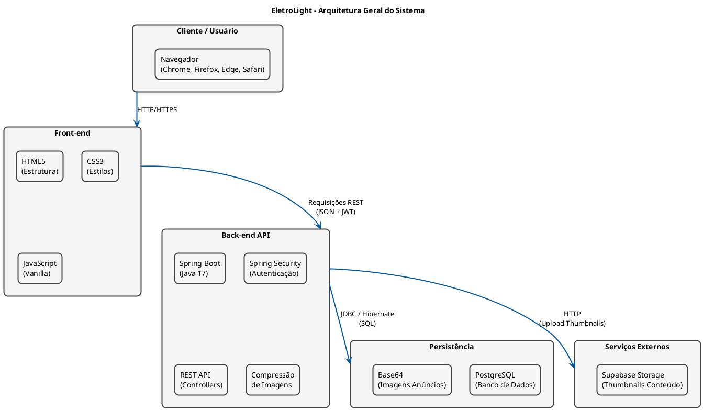

# Diagrama de Arquitetura — EletroLight

> **PlantUML** — Use o [PlantUML Online](http://www.plantuml.com/plantuml) ou extensão do VS Code.

```plantuml
@startuml

skinparam backgroundColor #fefefe
skinparam shadowing false
skinparam rectangle {
    BackgroundColor #f5f5f5
    BorderColor #424242
    BorderThickness 2
    RoundCorner 15
}

skinparam arrow {
    Color #01579b
    Thickness 2
}

title EletroLight - Arquitetura Geral do Sistema

rectangle "Cliente / Usuário" as Cliente {
    rectangle "Navegador\n(Chrome, Firefox, Edge, Safari)" as Navegador
}

rectangle "Front-end" as Frontend {
    rectangle "HTML5\n(Estrutura)" as HTML
    rectangle "CSS3\n(Estilos)" as CSS
    rectangle "JavaScript\n(Vanilla)" as JS
}

rectangle "Back-end API" as Backend {
    rectangle "Spring Boot\n(Java 17)" as Spring
    rectangle "Spring Security\n(Autenticação)" as Security
    rectangle "REST API\n(Controllers)" as API
    rectangle "Compressão\nde Imagens" as ImgCompress
}

rectangle "Persistência" as Persistencia {
    rectangle "PostgreSQL\n(Banco de Dados)" as Postgres
    rectangle "Base64\n(Imagens Anúncios)" as Base64
}

rectangle "Serviços Externos" as Externos {
    rectangle "Supabase Storage\n(Thumbnails Conteúdo)" as Supabase
}

' Conexões
Cliente --> Frontend : HTTP/HTTPS
Frontend --> Backend : Requisições REST\n(JSON + JWT)
Backend --> Persistencia : JDBC / Hibernate\n(SQL)
Backend --> Externos : HTTP\n(Upload Thumbnails)

@enduml
```
