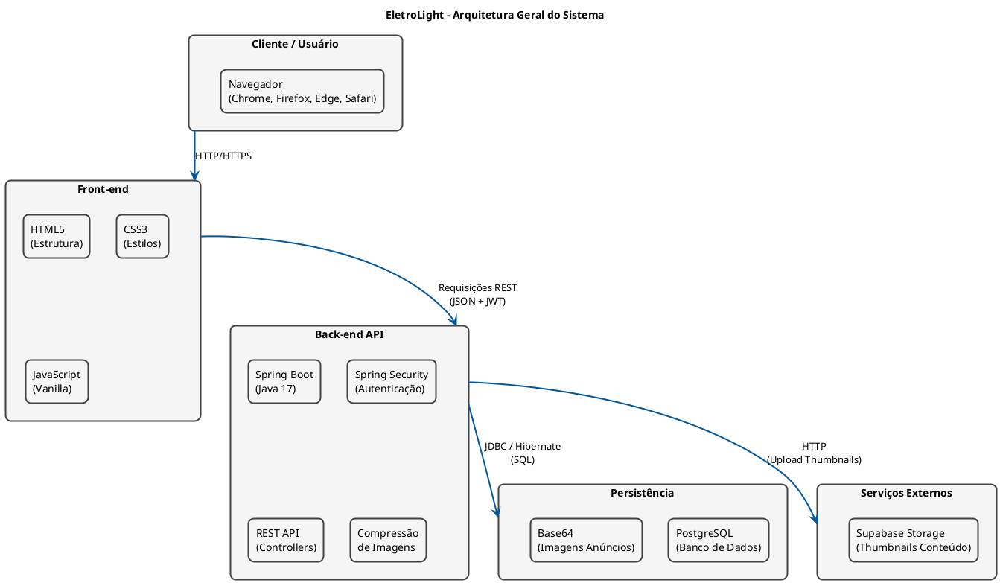
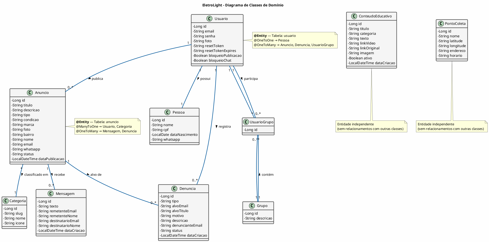

# Diagrama de Arquitetura — EletroLight

> **PlantUML** — Use o [PlantUML Online](http://www.plantuml.com/plantuml) ou extensão do VS Code.

---

# Diagrama de Classes — EletroLight (Domínio / JPA)

> **UML conforme OMG** — Diagrama de classes de domínio extraído do pacote `com.projetoEletro.domain.model`.

