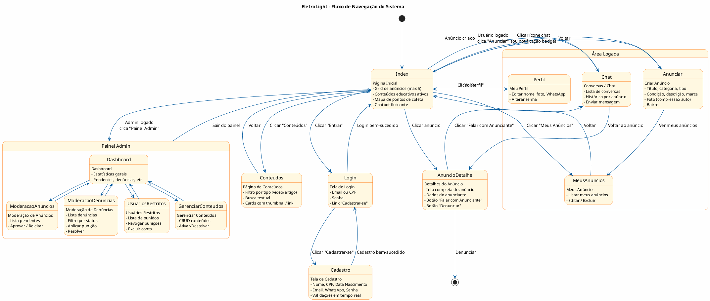
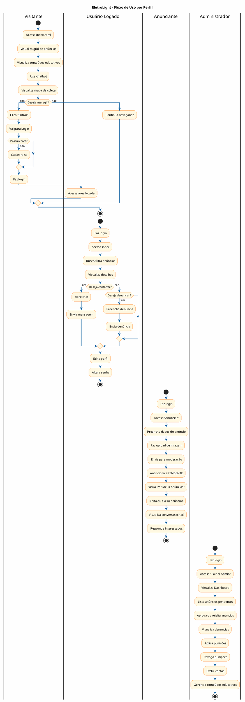
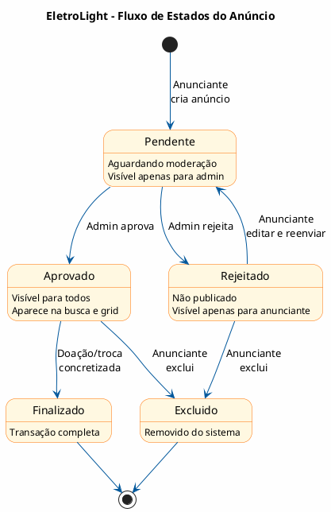

# Diagrama de Fluxo de Uso (Navegação) — EletroLight

> **PlantUML** — Use o [PlantUML Online](http://www.plantuml.com/plantuml) ou extensão do VS Code.

## 1. Fluxo Geral de Navegação (Todas as Telas)

---

## 2. Fluxo por Tipo de Usuário

---

## 3. Fluxo de Estados do Anúncio

