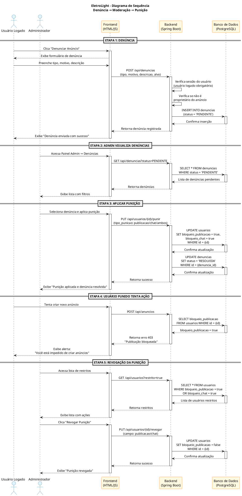

# Diagrama de Sequência — EletroLight

> **PlantUML** — Use o [PlantUML Online](http://www.plantuml.com/plantuml) ou extensão do VS Code.

## 1. Fluxo Principal: Publicação → Aprovação → Interesse → Chat

```plantuml
@startuml

skinparam sequenceMessageAlign center
skinparam shadowing false
skinparam actor {
    BackgroundColor #e1f5fe
    BorderColor #01579b
}
skinparam participant {
    BackgroundColor #fff8e1
    BorderColor #ff6f00
}

title EletroLight - Diagrama de Sequência\nPublicação → Aprovação → Interesse → Chat

actor "Anunciante" as A
actor "Visitante" as V
actor "Administrador" as ADM

participant "Frontend\n(HTML/JS)" as FE
participant "Backend\n(Spring Boot)" as BE
participant "Banco de Dados\n(PostgreSQL)" as DB

== ETAPA 1: PUBLICAÇÃO DO ANÚNCIO ==

A -> FE : Acessa página "Anunciar"
activate FE

FE -> BE : POST /api/anuncios
activate BE

BE -> BE : Valida campos obrigatórios\n(título, categoria, tipo, imagem)

BE -> BE : Comprime imagem (max 400px)

BE -> DB : INSERT INTO anuncios\n(status = 'PENDENTE')
activate DB

DB --> BE : Confirma inserção

deactivate DB

BE --> FE : Retorna anúncio criado\n(status: pendente)

deactivate BE

FE --> A : Exibe "Anúncio enviado para moderação"

deactivate FE

== ETAPA 2: MODERAÇÃO (ADMIN) ==

ADM -> FE : Acessa Painel Admin
activate FE

FE -> BE : GET /api/anuncios?status=PENDENTE
activate BE

BE -> DB : SELECT * FROM anuncios\nWHERE status = 'PENDENTE'
activate DB

DB --> BE : Lista de pendentes

deactivate DB

BE --> FE : Retorna anúncios pendentes

deactivate BE

FE --> ADM : Exibe lista para aprovação

deactivate FE

ADM -> FE : Clica "Aprovar Anúncio"
activate FE

FE -> BE : PUT /api/anuncios/{id}/aprovar
activate BE

BE -> DB : UPDATE anuncios\nSET status = 'APROVADO'
activate DB

DB --> BE : Confirma atualização

deactivate DB

BE --> FE : Retorna sucesso

deactivate BE

FE --> ADM : Exibe "Anúncio aprovado"

deactivate FE

== ETAPA 3: BUSCA E INTERESSE ==

V -> FE : Acessa página inicial
activate FE

FE -> BE : GET /api/anuncios?status=APROVADO
activate BE

BE -> DB : SELECT * FROM anuncios\nWHERE status = 'APROVADO'\nORDER BY created_at DESC\nLIMIT 5
activate DB

DB --> BE : Lista de anúncios aprovados

deactivate DB

BE --> FE : Retorna anúncios

deactivate BE

FE --> V : Exibe grid de anúncios

deactivate FE

V -> FE : Clica em "Ver Detalhes"
activate FE

FE -> BE : GET /api/anuncios/{id}
activate BE

BE -> DB : SELECT * FROM anuncios\nWHERE id = {id}
activate DB

DB --> BE : Dados do anúncio

deactivate DB

BE --> FE : Retorna detalhes

deactivate BE

FE --> V : Exibe página de detalhes

deactivate FE

== ETAPA 4: CHAT ENTRE USUÁRIOS ==

V -> FE : Clica "Enviar Mensagem"
activate FE

FE -> BE : POST /api/mensagens\n(anuncio_id, conteudo)
activate BE

BE -> BE : Verifica se usuário\nnão está bloqueado (chat)

BE -> DB : INSERT INTO mensagens
activate DB

DB --> BE : Confirma inserção

deactivate DB

BE --> FE : Retorna mensagem enviada

deactivate BE

FE --> V : Exibe confirmação

deactivate FE

FE -> A : Notificação (badge)\nNova conversa ativa

A -> FE : Acessa lista de conversas
activate FE

FE -> BE : GET /api/conversas
activate BE

BE -> DB : SELECT DISTINCT\nconversas do anunciante
activate DB

DB --> BE : Lista de conversas

deactivate DB

BE --> FE : Retorna conversas

deactivate BE

FE --> A : Exibe lista com foto e nome

deactivate FE

A -> FE : Abre chat específico
activate FE

FE -> BE : GET /api/mensagens?anuncio_id={id}
activate BE

BE -> DB : SELECT * FROM mensagens\nWHERE anuncio_id = {id}\nORDER BY created_at ASC
activate DB

DB --> BE : Histórico de mensagens

deactivate DB

BE --> FE : Retorna mensagens

deactivate BE

FE --> A : Exibe histórico cronológico

deactivate FE

A -> FE : Digita e envia resposta
activate FE

FE -> BE : POST /api/mensagens\n(resposta ao interessado)
activate BE

BE -> DB : INSERT INTO mensagens
activate DB

DB --> BE : Confirma inserção

deactivate DB

BE --> FE : Retorna mensagem enviada

deactivate BE

FE --> A : Exibe mensagem no chat

deactivate FE

FE -> V : Notificação (badge)\nNova mensagem recebida

@enduml
```

---

## 2. Fluxo Alternativo: Denúncia → Moderação → Punição

